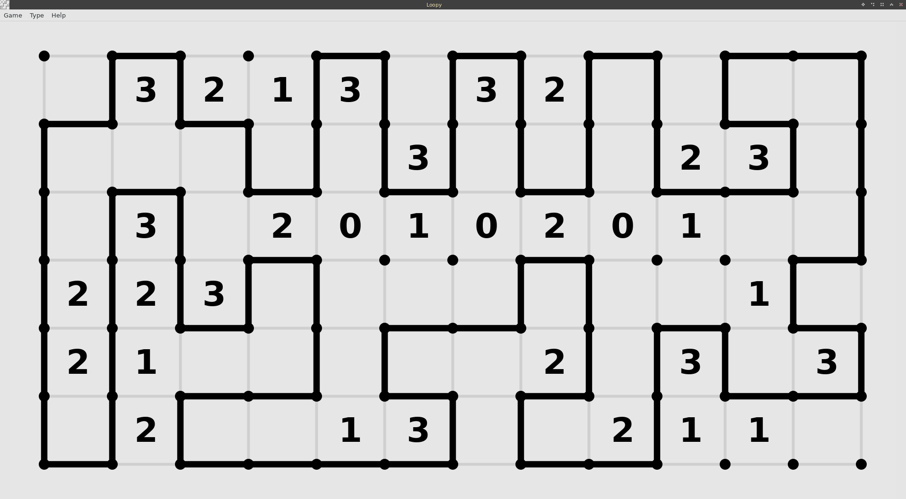
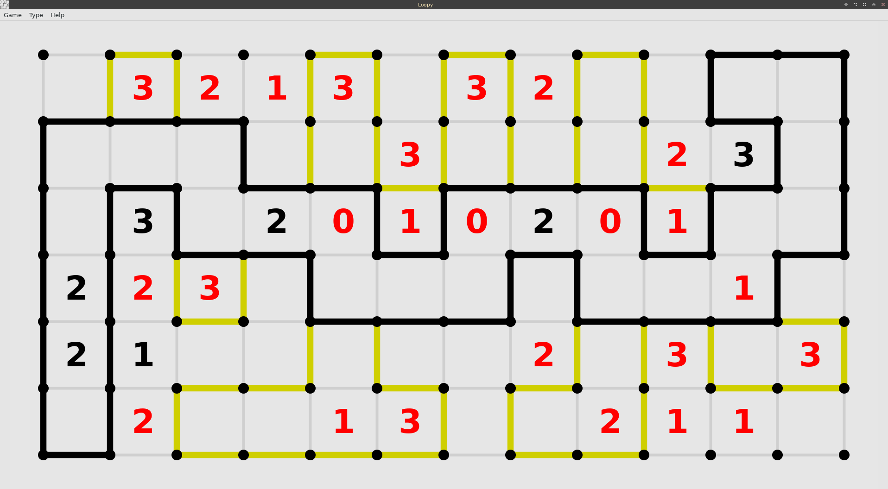
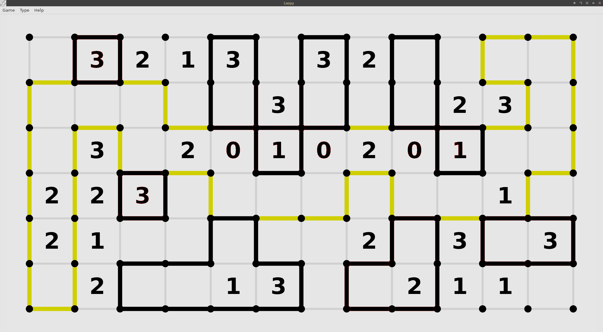

# stlcsv
A python program to study longest congruent series of boxes and noncongruent series of boxes in a loopy game.

    The purpose of the program is to analyze data of loopy games played.

    Loopy is one game of the Simon Tatham Puzzle Collection, https://www.chiark.greenend.org.uk/~sgtatham/puzzles/

    During my many years of playing the game, I have always had a hankering to review the longest contiguous
series of boxes and the non-contiguous series of boxes. So I've always tried other approaches to doing this.
Then, both during my marriage and after, I had wanted to program something, but life always seemed to get in
the way. Welp, after my marriage ended, I finally became free to attempt it and I needed to find a new
career, plus python looked promising. So I began to study python and started to write this little proggy.

How to use the program.

1. You need to set up the csv file that will be written to or read from. prompt $ set file filename
2. To write to the file, then you need to set up the game dimensions that you will be playing. prompt $ set game WxH
3. Then play a game and solve for the longest contiguous series and the noncontiguous series and add those by typing out, prompt $ C/N (Contiguous / Noncontiguous). (Using / so I only have to type on the keypad).

Below is one puzzle after it has been solved.

The next two images show the longest contiguous series of boxes and the noncontiguous set of boxes.

